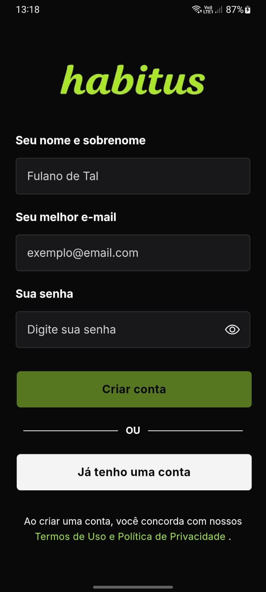
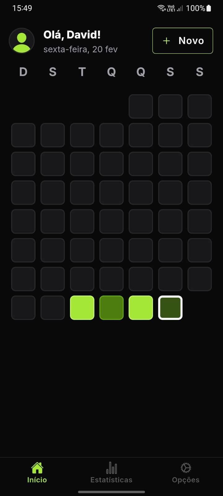
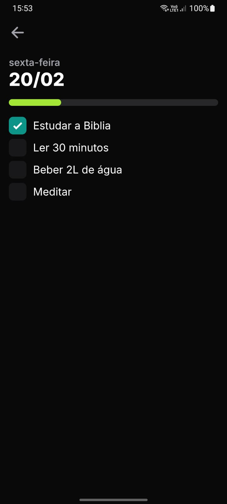
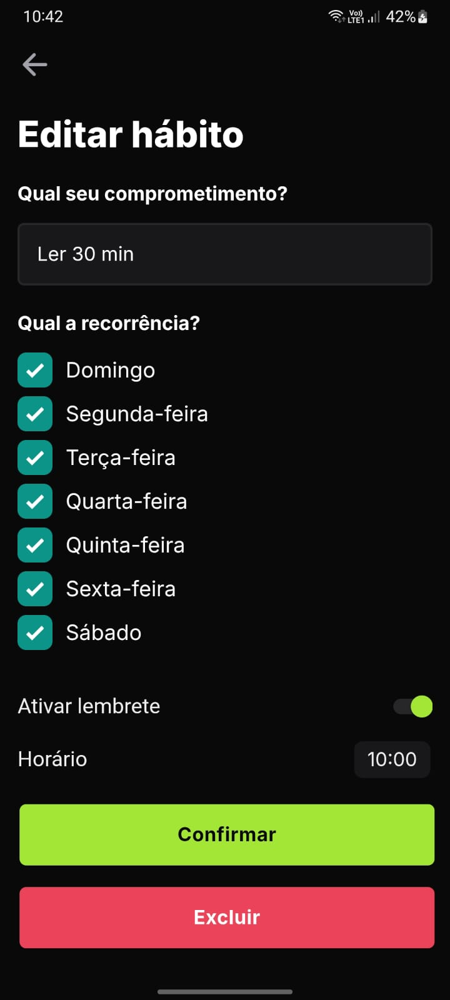
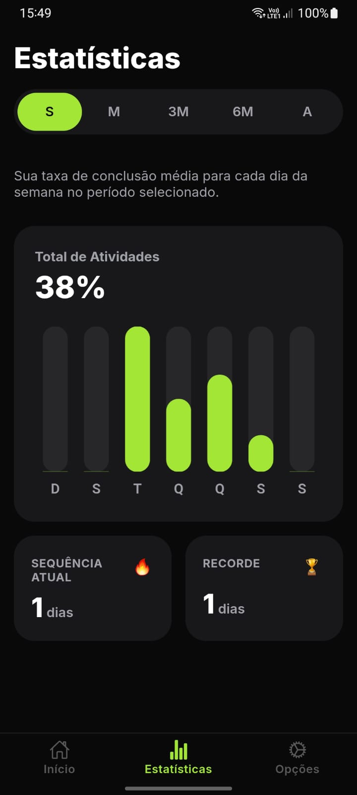

# Habitus

Welcome to Habitus!

Habitus is a powerful habit management application designed to help you track and improve your daily routines. With user-friendly features and intelligent tracking, Habitus assists you in cultivating positive habits, saving time, and ensuring consistent progress towards your goals.

## Key Features

- **Customized Habit Tracking**: Create and customize habits for your specific goals and routines.
- **Progress Tracking**: Visualize habit streaks, completion rates, and overall progress.
- **Cloud Sync**: Store and sync habits across devices for seamless access and backup.
- **Reminders and Notifications**: Set custom daily reminders to stay on track and receive fun, motivating notifications.

### To Do
- **Social Features**: Connect with friends and share your progress.

## Screenshots

<table>
  <tr>
    <td></td>
    <td></td>
    <td></td>
  </tr>
  <tr>
    <td></td>
    <td></td>
    <td></td>
  </tr>
</table>

*Figure 1: Register Screen. Figure 2: Home Screen. Figure 3: Habit Details Screen. Figure 4: Statistics Screen. Figure 5: Options Screen.*

## How to Use

1. **Installation**: [Download the APK](#) and install it on your Android smartphone.
2. **Sign-Up**: Create an account or log in using your existing account.
3. **Habit Creation**: Tap the "+" button to create a new habit.
4. **Tracking Habits**: Enter the habit details and start tracking your progress.
5. **Viewing Progress**: Monitor your habit streaks and completion rates in the app to stay motivated and accountable.

## System Requirements

- **Platform**: Android 10+ or iOS 12+.
- **Connection**: Internet Connection

## Technologies used

- PHP, Slim and MySQL (API)
- Vue 3, Ionic, Capacitor (Mobile)

Thank you for choosing Habits to help you achieve your goals and build healthier habits! We're here to support you on your journey towards a more fulfilling lifestyle. If you have any questions or need assistance, don't hesitate to reach out.

Happy habit building!